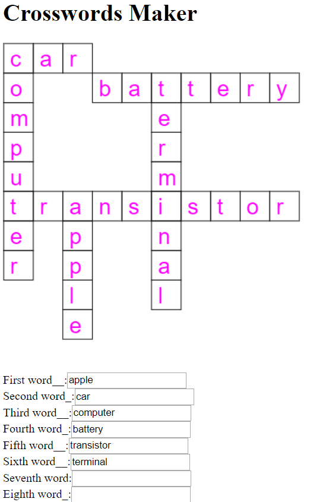

# Crosswords Puzzle Maker
Give in the words and it will make you the crosswords puzzle...

# Description
This is a Javascript program inside a HTML page that asks for words to make a crossword puzzle and tries to maximize the number of crosses over all words.  
The algorithm that was developed, uses the strategy of BackTracking to search for the best solution in the solution space. Less words or longer words contributes to a smaller search space. The BackTracking strategy implemented here, uses low memory and in most cases it's pretty fast, but in a small number of cases it can be a bit slow. This depends on the size of the search space. At the beginning of the code you can configure the size of the board to search, currently it is a 11 x 11 square board, but it can be of different sizes. The size of the Canvas can also be different. It search's in all valid combination ranking it for the most crossovers among all words. 

# ScreenShoot

# Improvements for a latter phase
Implement a feature to automatically stop processing after a predetermine time ex: 1 minute. This will stop the search, but it's only necessary in a small number of cases. In the normal case it's pretty fast. 

# References
* [Wikipedia - Crossword](https://en.wikipedia.org/wiki/Crossword)
* [The BackTracking Algorithm](https://github.com/joaocarvalhoopen/The_BackTracking_Algorithm)
* [Algorithm to generate a crossword](https://stackoverflow.com/questions/943113/algorithm-to-generate-a-crossword)
* [Source of words to make crosswords in several languages](http://www.gwicks.net/dictionaries.htm)

# License
MIT Open Source License

# Have fun!
Best regards,  
Joao Nuno Carvalho  
